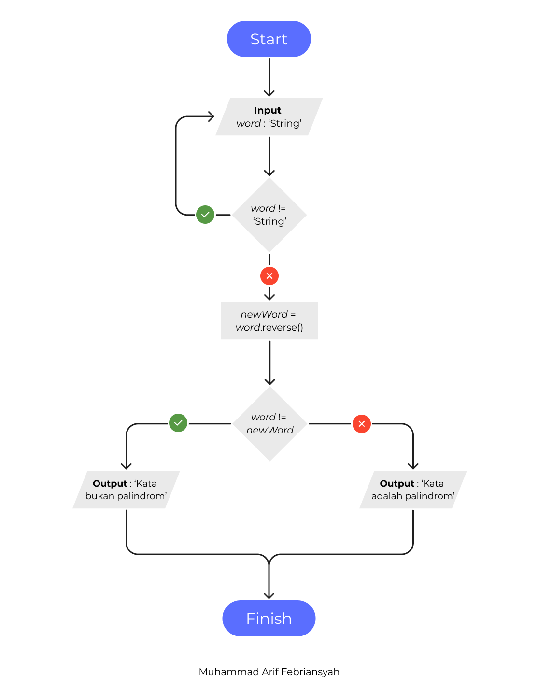
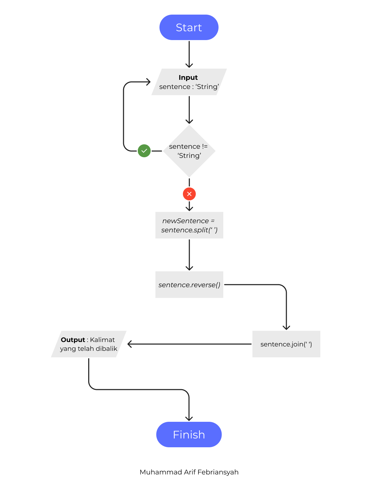

<h1>Deteksi Palindrom</h1>
<h3>Algoritma</h3>
<ol>
    <li>Input Kata Kedalam variabel word.</li>
    <li>Validasi apakah word tidak sama dengan String.</li>
    <li>Jika kondisi true maka kembali ke Input.</li>
    <li>Jika kondisi false buat variabel baru bernama newWord yang memiliki variabel word yang di reverse(dibalik).</li>
    <li>Membuat kondisi jika word tidak sama dengan newWord.</li>
    <li>Jika kondisi true maka Output : ‘Kata bukan palindrom’. </li>
    <li>Jika kondisi false maka Output : ‘Kata adalah palindrom’.</li>
</ol>
 
<h3>Flowchart</h3>

<h1>Reserve Words</h1>
<h3>Algoritma</h3>
<ol>
    <li>Input Kalimat Kedalam variabel sentence.</li>
    <li>Validasi apakah sentence tidak sama dengan String.</li>
    <li>Jika kondisi true maka kembali ke Input.</li>
    <li>Jika kondisi false, buat variabel baru lalu pisahkan kalimat dengan ditandai spasi.</li>
    <li>Lalu balikan susunan kalimat.</li>
    <li>Lalu menggabungkan susunan kalimat yang telah di balik.</li>
    <li>Maka Output : Kalimat yang telah dibalik.</li>
</ol>
 
<h3>Flowchart</h3>

